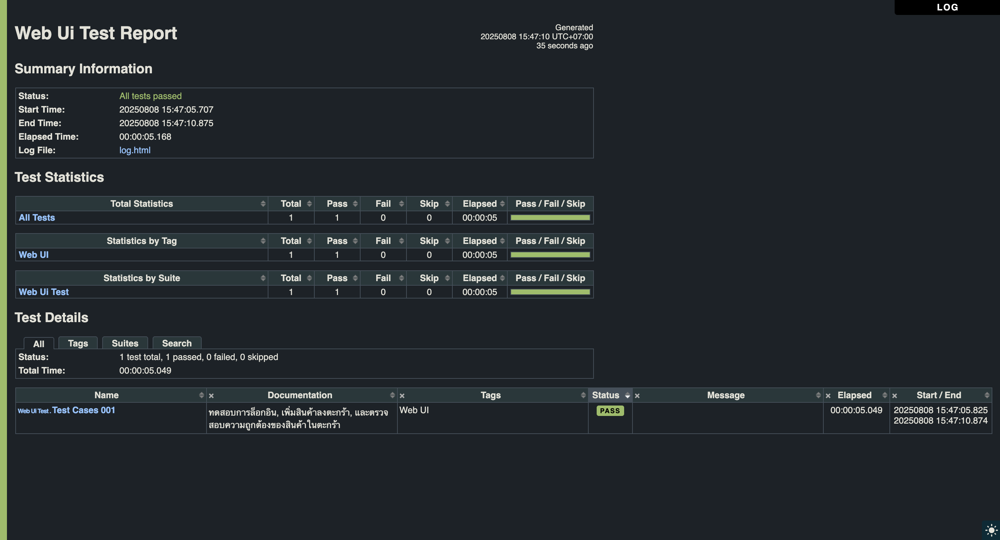
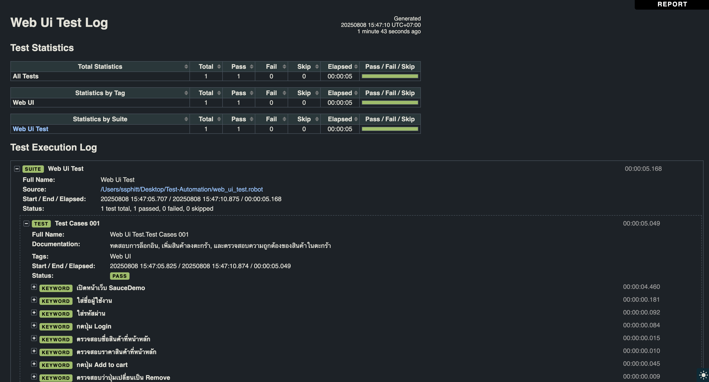
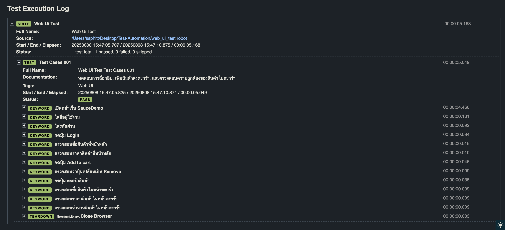
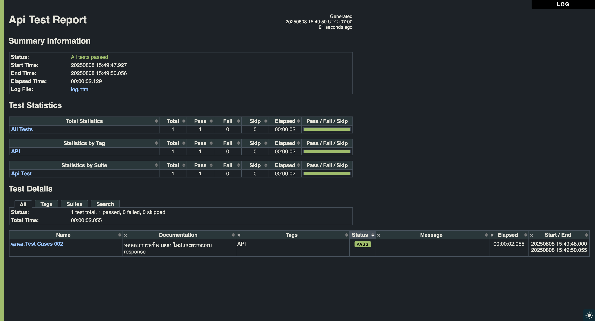
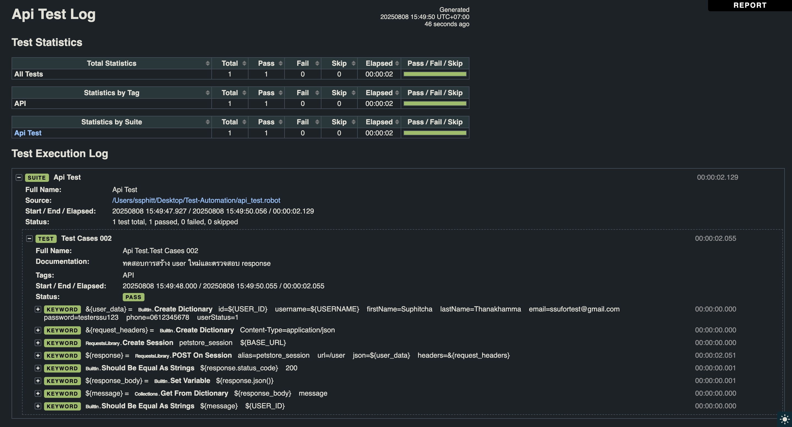

# Installation

1. Setup venv

   ```sh
   python -m venv venv
   ```

2. Activate virtual environment

   - macOS/linux

     ```sh
     source venv/bin/activate
     ```

   - windows

     ```sh
     venv\Scripts\activate
     ```

3. Install Robotframework

   ```sh
   pip install robotframework
   ```

4. Install Robotframework-SeleniumLibrary

   ```sh
   pip install robotframework-seleniumLibrary
   ```
5. Install Robotframework-RequestsLibrary

   ```sh
   pip install robotframework-requests
   ```

# Assignment 2.1: Web UI Automation

1. Source code : [web_ui_test.robot](./web_ui_test.robot)
2. วิธีการรันสคริปต์
   ```sh
   robot web_ui_test.robot
   ```
3. รายงานผลการทดสอบ
   
   
   

# Assignment 2.2: API Automation

1. Source code : [api_test.robot](./api_test.robot)
2. วิธีการรันสคริปต์
   ```sh
   robot api_test.robot
   ```
3. รายงานผลการทดสอบ
   
   
